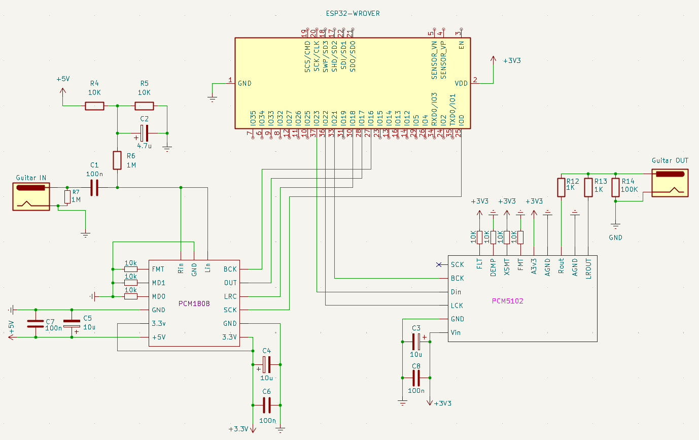

# ADOZ Guitar pedal
Projektni zadatak iz predmeta algoritmi digitalne obrade zvuka (RT-RK 3. godina)

This project implements a **real-time digital guitar pedal** based on the **ESP32** platform.  
The audio signal is digitized using a **PCM1808 24-bit audio ADC**, processed in real time on the ESP32, and then forwarded to the output using **PCM5102 audio DAC**.

---

## Tools
- **PlatformIO**: vscode extension
- **Framework**: ESP-IDF
- **Platform**: espressif32
- **Board**: ESP32-WROOM-32
- **Modules**: PCM1808, PCM5102

---

## Compile
- Add PlatformIO extension to your vs code.
- PlatformIO --> Home --> Open project
- Select "source" directory.
- PlatformIO generates needed dependcies and allows upload to ESP32.

---

## Scheme

